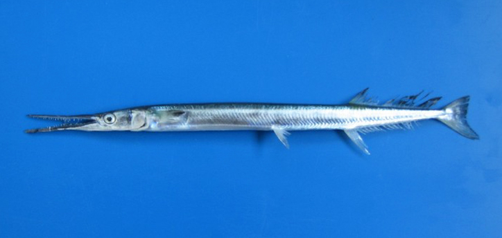

# Ribe-iglice (Syngnathidae spp.) / морская игла, ribe iglice

Не ядовитые, но острые когтеобразные костяные шипы могут травмировать кожу.

**Уровень опасности для человека:**  
- Низкий: механические травмы.

**Сезон и активность:**  
- В зарослях морской травы.

**Рекомендации местных жителей:**  
- Не трогайте без необходимости, защищайте руки.