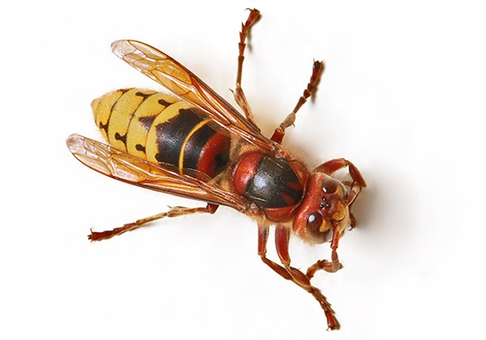

# Шершень европейский (Vespa crabro) / šeršenj

Самый крупный представитель жалящих перепончатокрылых Европы, достигает 3-4 см. Укус очень болезненный.

**Опасность для человека:**
- Средняя: болезненный укус, опасно при аллергии или множественных укусах.

**Как избежать и как действовать:**
- Не трогайте гнёзда, не провоцируйте насекомое.
- При укусе — холод, наблюдение; при аллергии — к врачу.