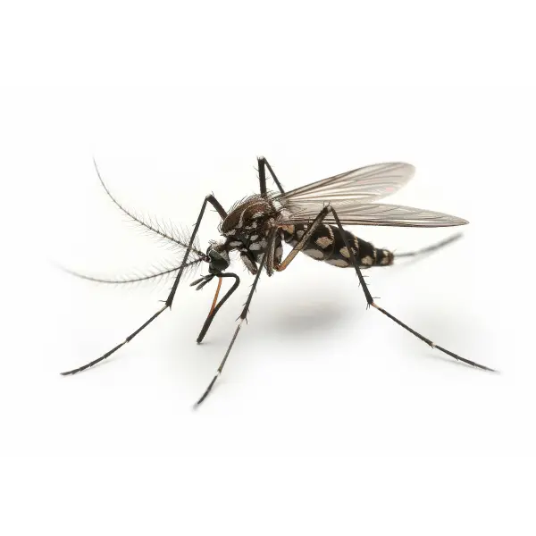

# Комар (Aedes albopictus) / komarac

Тигровый комар — инвазивный вид, отличающийся черно-белыми полосами на теле и лапках. Активно кусает днём. Может переносить вирус Зика, чикунгунью и другие инфекции.

**Уровень опасности для человека:**
- Средняя: зудящие укусы, возможна передача вирусных заболеваний.

**Сезон и активность:**
- Май–октябрь, пик активности на рассвете и закате.
- Обитает в стоячей воде, тенистых местах.

**Рекомендации местных жителей:**
- **Распознавание:** чёрно-белые полосы на теле и ногах.
- **Как избежать и как действовать:**
  - Используйте москитные сетки, репелленты.
  - Уничтожайте стоячую воду вокруг жилья.
  - При осложнениях после укуса — обратиться к врачу.
