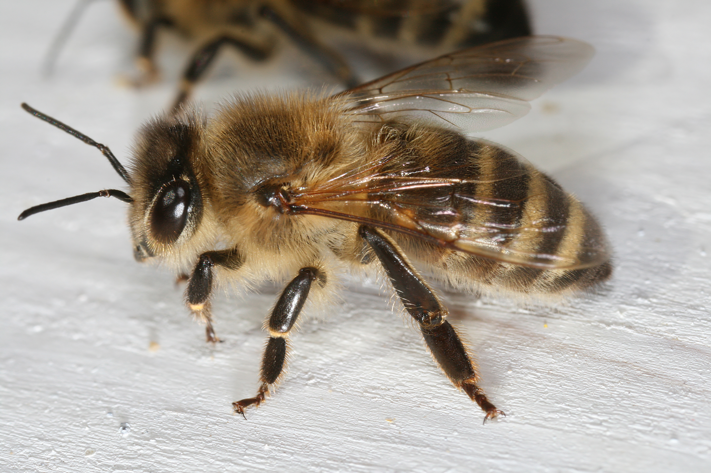

# Apis mellifera (Пчела / pčela)

Опылитель и производитель мёда. Живёт семьями. Жалит при защите, после чего погибает.

**Уровень опасности для человека:**
- Низкий/средний: укус вызывает боль, отёк, возможна аллергия.

**Сезон и активность:**
- Апрель–сентябрь, активность в тёплые солнечные дни.
- Обитает около цветущих растений.

**Рекомендации местных жителей:**
- **Распознавание:** жёлто‑чёрная полосатая окраска, пушистое тело.
- **Защита:** не делать резких движений около ульев.
- **Что делать при укусе:**
  1. Удалить жало ногтем или скребком.
  2. Промыть мыльной водой.
  3. Нанести крем со стероидами при отёке.

