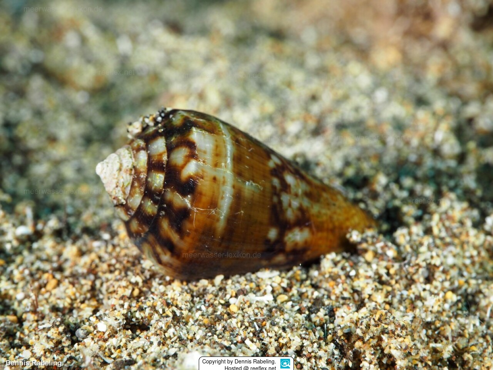

# Conus spp. (Конусы / Ribe-tikve)

Морские моллюски-хищники с конической раковиной и ядовитым гарпуном-зубом, которым они парализуют добычу. Опасны при непосредственном контакте — яд содержит нейротоксины, которые могут вызвать тяжелые симптомы и даже привести к смерти.

**Уровень опасности для человека:**  
- Средний-высокий: укусы токсичны, возможны серьезные осложнения и летальный исход.

**Сезон и активность:**  
- Активны круглый год, прячутся в песке и среди камней преимущественно на мелководье.

**Рекомендации местных жителей:**
- **Распознавание:**
  - Форма раковины обычно строго коническая, гладкая и блестящая.
  - Окрас разнообразный, часто с характерным сложным узором — белые, желтоватые или кремовые пятна на темном фоне, у некоторых видов — черная с белыми ромбовидными пятнами (как у мраморного конуса).
  - Размер обычно составляет 5–12 см, в зависимости от вида.
- **Защита:**
  - Не берите раковины в руки и не трогайте моллюсков живыми или мертвыми — они могут жалить даже после смерти.
  - Не наступайте босиком на дне, особенно в районах с камнями и песком — носите защитную обувь для плавания.
  - Будьте особенно осторожны на мелководье и в местах скопления раковин.
  - Конусы часто прячутся и активны ночью, но некоторые виды могут быть активны и днём.
- **Что делать при контакте:**
  1. Не паниковать, но максимально ограничить движение — укус содержит нейротоксин, и обездвиженность замедляет распространение яда.
  2. Если в ране осталось жало, не пытайтесь выдавливать яд — лучше аккуратно удалить жало острым и чистым инструментом.
  3. Немедленно обратиться за медицинской помощью: укус может привести к параличу мышц, затрудненному дыханию и остановке сердца.
  4. Не накладывать жгут, не разрезать и не прижигать рану.
  5. Место поражения зафиксировать — попытаться снизить подвижность конечности, можно приложить холод для уменьшения боли (холод не нейтрализует яд).
  6. Следить за дыханием и сердцебиением пострадавшего вплоть до приезда врачей.
- **Важно:**
  - Противоядие существует, но специфично для разных видов, поэтому срочно доставьте пострадавшего в больницу.
  - Описаны случаи смертельных исходов даже у здоровых взрослых людей после укусов некоторых видов конусов.