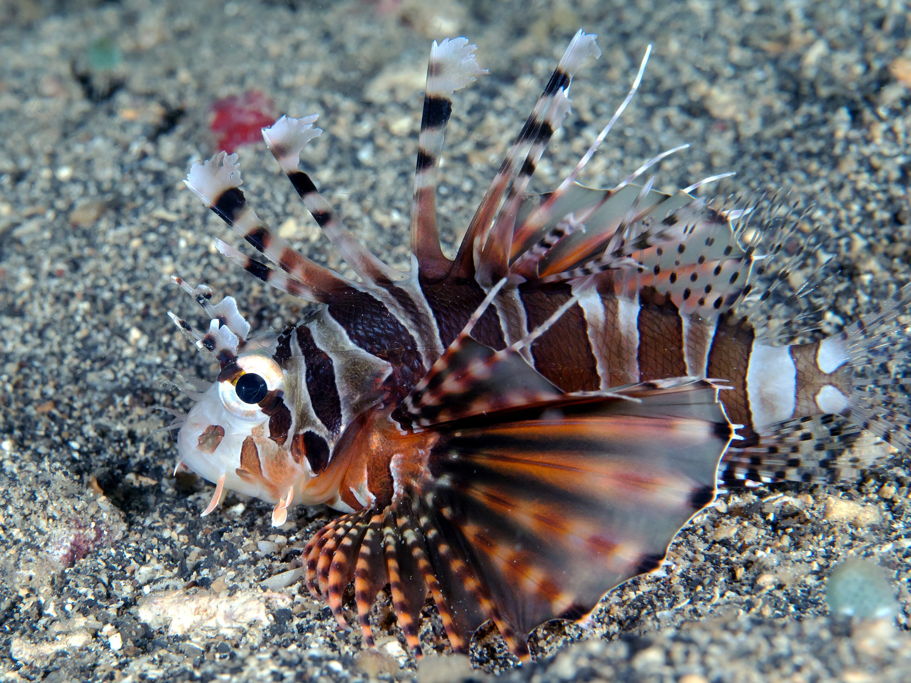

# Dendrochirus zebra (Riba-pauk / ribica kukac)

Редкий вид, родственник рыбы-лео. Имеет ядовитые шипы, укус болезнен.

**Уровень опасности для человека:**
- Средний: ядовитые шипы вызывают боль и воспаление.

**Сезон и активность:**
- Круглогодично на рифах и каменистых участках (5–30 м).

**Рекомендации местных жителей:**
- **Распознавание:** полосатая окраска, широкий грудной плавник.
- **Защита:** не наступать и не прикасаться без защиты.
- **Что делать при контакте:**
  1. Удалить шипы пинцетом.
  2. Опустить рану в горячую воду (40–45 °C) на 30 мин.

