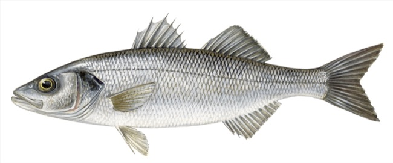

# Dicentrarchus labrax (Брадин / brancin)

**Популярность:** 2-е место по упоминаниям в местных соцсетях и форумах.

**Сезон и активность:**
- Основной сезон: май–сентябрь.
- Активность: ночные и ранние утренние часы, особенно у каменистых берегов.

**Техника ловли:**
- Основной метод: спиннинг, джиггинг.
- Используемые удилища: средний тест 10–30 г.

**Троллинг:**
- Скорость: 2,5–3 узла.
- Место: прибрежная полоса (10–20 м).
- Глубина приманки: 3–6 м.
- Вес и тип приманки: 15–35 г воблеры и металлические блёсны.

**Наживки:**
- Мелкая сардина, кальмар, креветка.

**Оснастка:**
- Поводок 0,25–0,35 мм флюорокарбон, крючок №4–5.

**Рецепты от местных:**
1. **Брадин под оливковой корочкой:**
   - Ингредиенты: филе брадина, оливковое масло, чеснок, вяленые томаты, каперсы, зелень.
   - Шаги:
     1. Филе посолить, поперчить, обжарить со стороны кожи по 5 минут.
     2. Смешать масло с мелко нарубленным чесноком, вялеными томатами и каперсами.
     3. Снять рыбу с огня, смазать масляной смесью, запечь в духовке 8–10 минут при 180 °C.

2. **Брадин в лимонном соусе:**
   - Ингредиенты: целая рыба (~700 г), лимон, белое вино, лук-шалот, петрушка, оливковое масло.
   - Шаги:
     1. Очистить рыбу, сделать надрезы по бокам, вложить в них кружки лимона.
     2. В форме смешать вино, масло, нарезанный шалот и зелень.
     3. Полить рыбу, запекать 20–25 минут при 190 °C.

