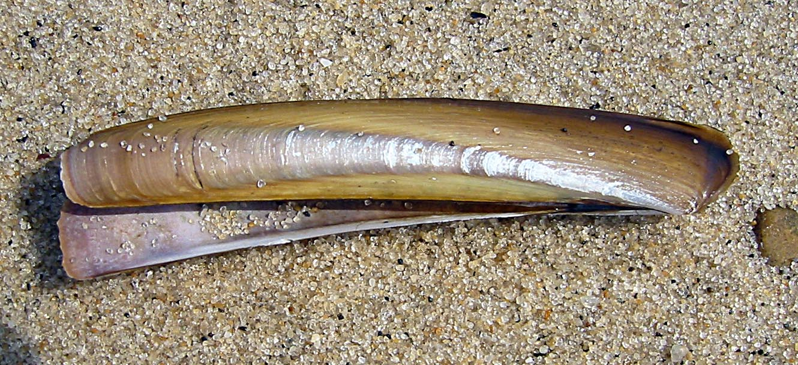

# Ensis ensis (Оштрица / ostrica)

**Популярность:** 15-е место по упоминаниям в местных соцсетях и форумах.

**Сезон и активность:**
- Основной сезон: осень–зима (сентябрь–февраль).
- Активность: добыча на мелководье 1–5 м при отливе.

**Техника сбора:**
- Основной метод: ручной сбор или тяга сеткой.

**Троллинг и наживки:**
- Не применяются.

**Оснастка:**
- Не применимо.

**Рецепты от местных:**
1. **Оштрица на пару:**
   - Ингредиенты: оштрица, вода, соль.
   - Шаги:
     1. Приготовить на пару 5–7 минут.
     2. Подавать с лимоном.

2. **Паста с оштрицей:**
   - Ингредиенты: оштрица, спагетти, чеснок, оливковое масло, петрушка.
   - Шаги:
     1. Отварить пасту, обжарить чеснок и оштрицу.
     2. Смешать с пастой, добавить зелень.

