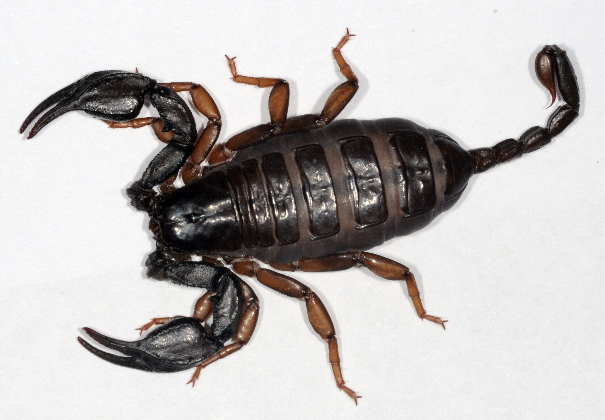

# Euscorpius italicus (Скорпион / škorpion)

Маленький скорпион (до 4 см) с тёмной окраской. Встречается в тёплых и сухих районах, любит прятаться под камнями.

**Уровень опасности для человека:**
- Очень низкая: укус похож на укус пчелы, серьёзных осложнений не вызывает.

**Сезон и активность:**
- Июнь–сентябрь, ночная активность.
- Обитает под камнями, в щелях стен.

**Рекомендации местных жителей:**
- **Распознавание:** тёмно-коричневый, длина до 4 см.
- **Защита:** Проверяйте обувь и вещи перед использованием. Носить обувь при ходьбе по камням, проверять места хранения.
- **Что делать при укусе:**
  1. Промыть ранку.
  2. Прикладывать холод.
  3. При сильных симптомах обращаться к врачу.

