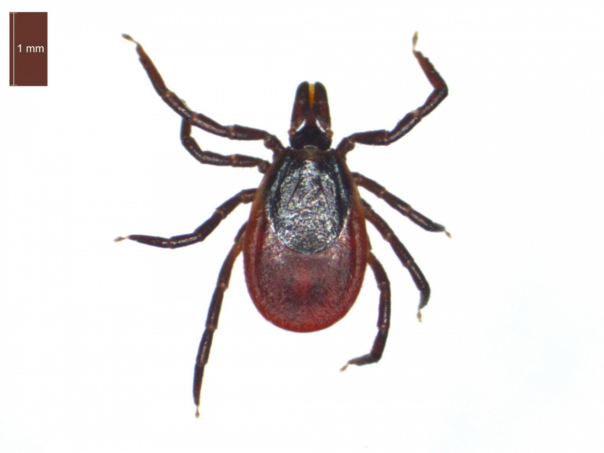

# Клещ (Ixodes ricinus) / krpelj

Паразитирующий клещ, часто встречающийся в лесистых и травянистых районах Хорватии. Основной переносчик болезни Лайма, клещевого энцефалита и других инфекций. Может присасываться к человеку и животным для кровососания.

**Уровень опасности для человека:**
- Средняя: лёгкие аллергические реакции, возможна передача тяжёлых инфекций.

**Сезон и активность:**
- Апрель–октябрь, пик активности весной и осенью.
- Обитает в лесах, на лугах, в высокой траве.

**Рекомендации местных жителей:**
- **Распознавание:** мелкое, овальное тело, ржаво-красного цвета перед насыщением, после засасывания — тёмное и округлое.
- **Как избежать и как действовать:**
  - Носите закрытую одежду и используйте репелленты в природе.
  - После прогулки тщательно осматривайте кожу.
  - При обнаружении клеща аккуратно удалите его пинцетом и обработайте место антисептиком. Следить за самочувствием.

