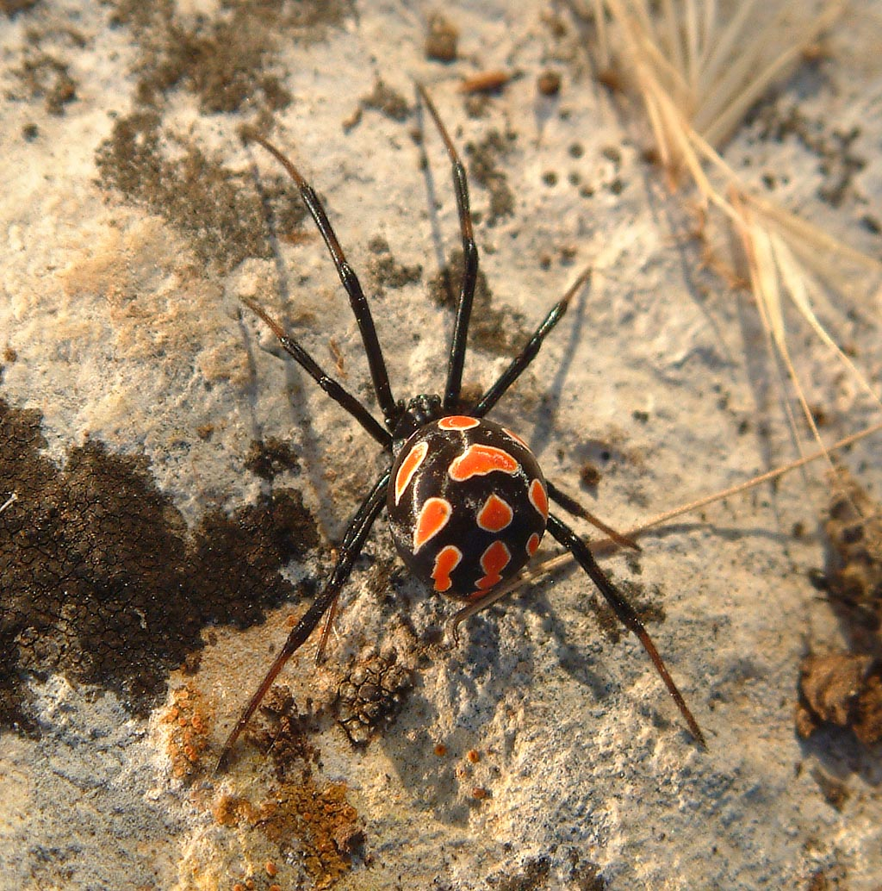

# Каракурт (Latrodectus tredecimguttatus) / karakurt

Чёрная вдова — ядовитый паук чёрного цвета с красными пятнами на брюшке. Встречается в тёплых регионах, прячется в норах и кустах.

**Уровень опасности для человека:**
- Высокий: нейротоксин вызывает боль, судороги, в редких случаях — опасные осложнения.

**Сезон и активность:**
- Май–сентябрь, ночная активность.
- Обитает в сухих, тёплых местах: под камнями, вокруг зданий.

**Рекомендации местных жителей:**
- **Распознавание:** чёрный паук с яркими красными точками на брюшке.
- **Защита:** носить перчатки при работе на земле, проверять обувь.
- **Что делать при укусе:**
  1. Ограничить движение поражённой конечности.
  2. Приложить холод.
  3. Немедленно вызвать скорую.

