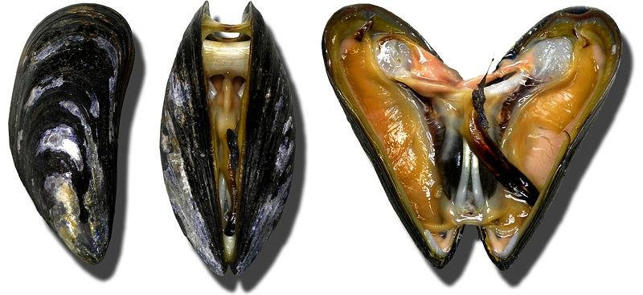

# Mytilus galloprovincialis (Миди / midi)

**Популярность:** 13-е место по упоминаниям в местных соцсетях и форумах.

**Сезон и активность:**
- Основной сезон: октябрь–март.
- Активность: собирают на мелководье и скалистых участках.

**Техника сбора:**
- Основной метод: ручной сбор при отливе.

**Наживки и троллинг:**
- Применяются как наживка для ловли рыбы, но не актуально для троллинга.

**Оснастка:**
- В качестве наживки насаживаются на крючок №6–8.

**Рецепты от местных:**
1. **Миди в белом вине:**
   - Ингредиенты: миди (~1 кг), белое вино, чеснок, петрушка, оливковое масло.
   - Шаги:
     1. Обжарить чеснок, добавить миди и вино.
     2. Тушить под крышкой 5–7 минут до раскрытия.
     3. Посыпать петрушкой.

2. **Паэлья с мидиями:**
   - Ингредиенты: рис, шафран, бульон, миди, морепродукты.
   - Шаги:
     1. Приготовить рис с шафраном и бульоном.
     2. За 5 минут до готовности добавить миди и морепродукты.

