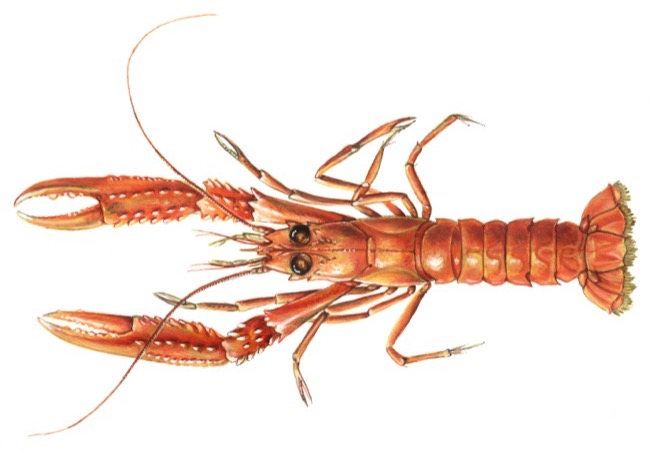

# Nephrops norvegicus (Шкампи / škampi) лангустины

Небольшие ракообразные, популярные и широко используемые в приготовлении “бузары” — традиционного хорватского блюда с морепродуктами и вином.

**Сезон и активность:**
- Основной сезон: май–сентябрь.
- Активность: ночная, держатся в норах на глубинах 20–100 м.

**Техника ловли:**
- Основной метод: ловушки (верши) или крючковая снасть.
- Используемые снасти: ячейковые ловушки, крючки №1–2.

**Троллинг:**
- Не применяется.

**Наживки:**
- Рыбные обрезки, моллюски.

**Оснастка:**
- Леска 0,4 мм, грузило 30–50 г.

**Рецепты от местных:**
1. **Шкампи в чесночном масле:**
   - Ингредиенты: шкампи (~500 г), чеснок, оливковое масло, петрушка, перец чили.
   - Шаги:
     1. Обжарить измельченный чеснок и чили в масле 1–2 минуты.
     2. Добавить шкампи, готовить 4–5 минут.
     3. Посыпать петрушкой перед подачей.

2. **Ризотто с шкампи:**
   - Ингредиенты: рис арборио, бульон, шкампи, лук, белое вино, пармезан.
   - Шаги:
     1. Обжарить лук, влить рис, вино и постепенно добавлять бульон.
     2. За 5 минут до готовности добавить шкампи и пармезан.

