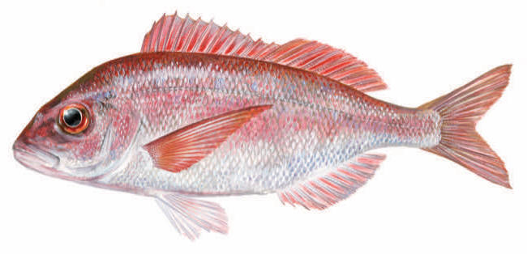

# Pagellus erythrinus (Арбун / arbun)

Рыба из семейства Sparidae с розоватой окраской и вкусным мясом. Широко используется в хорватской кухне, запекается и жарится как альтернатива ораде и брадину.

**Сезон и активность:**
- Основной сезон: май–июнь, сентябрь–октябрь.
- Активность: дневные часы, у каменистого дна на глубинах 10–30 м.

**Техника ловли:**
- Основной метод: донный спуск с грузилом.
- Используемые удилища: тест 20–40 г.

**Троллинг:**
- Не применяется.

**Наживки:**
- Креветка, мелкая сельдь.

**Оснастка:**
- Леска 0,3 мм, поводок флюорокарбон 0,25 мм, крючок №4.

**Рецепты от местных:**
1. **Арбун в фольге с травами:**
   - Ингредиенты: целая рыба, лимон, розмарин, тимьян, оливковое масло.
   - Шаги:
     1. Замариновать рыбу в масле с травами и лимоном.
     2. Запечь в фольге при 180 °C 20 минут.

2. **Арбун в сливочном соусе:**
   - Ингредиенты: филе, сливки, лук, чеснок, белое вино.
   - Шаги:
     1. Обжарить лук и чеснок, добавить вино и сливки.
     2. Тушить филе в соусе 8–10 минут.

