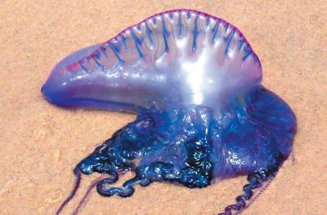

# Physalia physalis (Португалска галия / portugalska_galija)

Жаркий колониальный организм — не настоящая медуза, а комплекс особей, у поверхности моря у которых длинные ядовитые щупальца до нескольких метров длиной. Контакт вызывает сильную боль, ожоги, аллергию, в редких случаях — шок и опасность для жизни.

**Уровень опасности для человека:**
- Крайне опасна: при контакте с щупальцами возможны сильные ожоги, системные реакции, анафилаксия.

**Сезон и активность:**
- Месяцы наибольшего распространения: июнь–октябрь.
- Активность: прибрежные воды, часто на поверхности и у береговой линии.

**Рекомендации местных жителей:**
- **Распознавание:** голубовато-прозрачный пузырь длиной до 30 см с пурпурной каймой и длинными щупальцами.
- **Защита:** избегать плавания в местах скопления, при обнаружении ставить предупреждающие знаки на берегу.
- **Что делать при контакте:**
  1. Осторожно удалить остатки щупалец с поверхности кожи при помощи палки или перчаток.
  2. Промыть поражённое место морской водой (не пресной).
  3. Прижечь уксусом или раствором пищевой соды.
  4. При сильной боли или признаках аллергии незамедлительно обратиться за медицинской помощью.

