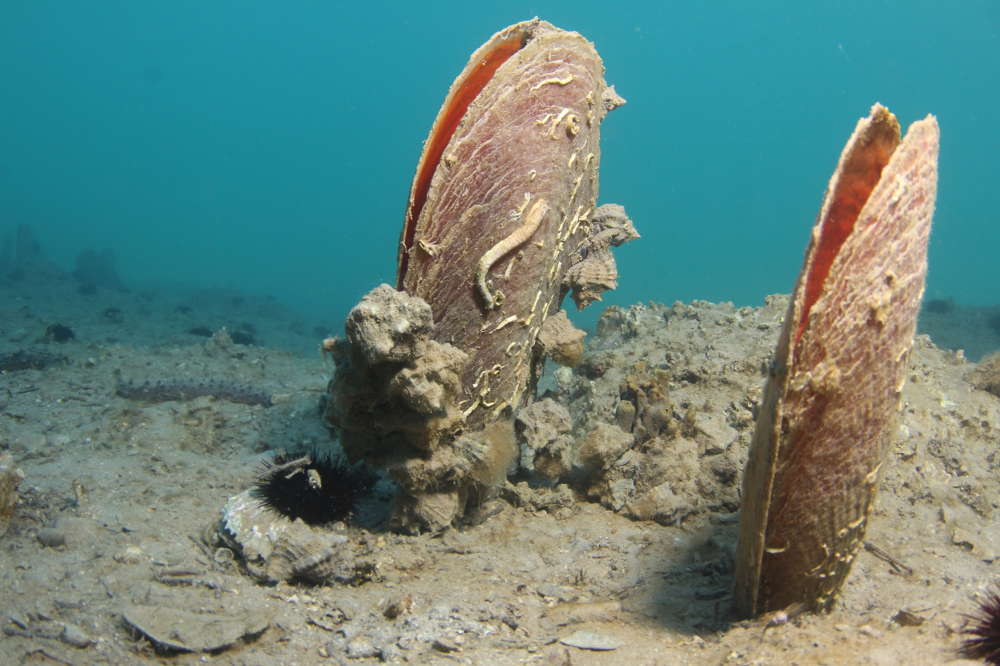

# Pinna nobilis (Шкољка / školjka)

**Популярность:** 14-е место по упоминаниям в местных соцсетях и форумах.

**Сезон и активность:**
- Основной сезон: сезон сбора: май–июнь.
- Активность: встречается на глубинах 5–20 м в зарослях.

**Техника сбора:**
- Основной метод: подводное собирание при дайвинге.

**Троллинг и наживки:**
- Не применяются.

**Оснастка:**
- Не применимо.

**Рецепты от местных:**
1. **Шкољка тушёная в томатном соусе:**
   - Ингредиенты: мясо шкољки, томатный соус, чеснок, лук, перец.
   - Шаги:
     1. Извлечь мясо, очистить от пленок.
     2. Тушить в соусе 20 минут.

2. **Шкољка в винном маринаде:**
   - Ингредиенты: мясо, белое вино, оливковое масло, зелень.
   - Шаги:
     1. Мариновать мясо 1 час.
     2. Быстро обжарить на гриле.

