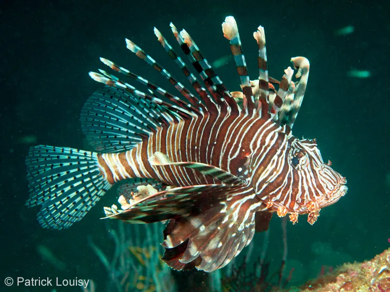

# Pterois miles (Рыба‑лео / riba-leo)

Инвазивный вид ядовитой хищной рыбы с длинными шипами. Распространилась в Адриатике, представляет серьёзную угрозу.

**Уровень опасности для человека:**
- Высокий: ядовитые шипы вызывают сильную боль, тошноту и отёки.

**Сезон и активность:**
- Круглогодично в тёплых водах, норы на глубине 5–50 м.

**Рекомендации местных жителей:**
- **Распознавание:** пёстрая окраска, длинные шипы на плавниках.
- **Защита:** соблюдать дистанцию, не трогать руками.
- **Что делать при контакте:**
  1. Опускать рану в горячую воду (45 °C) на 30–60 минут.
  2. При серьёзных симптомах обратиться в больницу.

