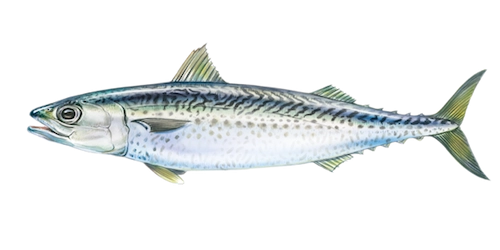

# Scomber colias (Скуша / skuša)

Жирная морская рыба, популярна в копчёном, жареном и солёном виде. В Адриатике встречаются оба вида, которые употребляют в пищу. Часто используется в рыбацких блюдах и уличной кухне.

**Сезон и активность:**
- Основной сезон: июнь–октябрь.
- Активность: дневные часы, часто в стаях у поверхности.

**Техника ловли:**
- Основной метод: спиннинг «пелагический» с мелкими металлическими блёснами.
- Используемые удилища: лёгкие, тест 5–15 г.

**Троллинг:**
- Скорость: 5–6 узлов.
- Место: открытое море, 10–30 м от берега.
- Глубина приманки: 1–3 м.
- Вес и тип приманки: 10–20 г блёсны-«кавитации».

**Наживки:**
- Мелкие рыбки (чебак), кусочки кальмара.

**Оснастка:**
- Поводок 0,2 мм флюорокарбон, крючок №6–8.

**Рецепты от местных:**
1. **Скуша с овощами на сковороде:**
   - Ингредиенты: скуша (филе), баклажан, цуккини, помидоры, чеснок, оливковое масло, зелень.
   - Шаги:
     1. Нарезать овощи кубиками, обжарить с чесноком.
     2. Добавить кусочки скуши, жарить 4–5 минут.
     3. Приправить солью, перцем, посыпать зеленью.

2. **Скуша в кляре:**
   - Ингредиенты: филе скуши, мука, яйцо, газированная вода, соль.
   - Шаги:
     1. Приготовить кляр: смешать муку, яйцо и воду до консистенции густой сметаны.
     2. Обмакнуть филе, обжарить на среднем огне до золотистой корочки.

