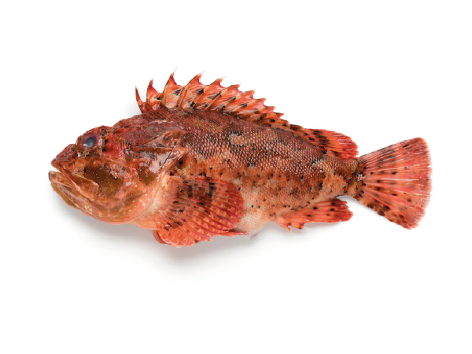

# Scorpaena scrofa (Рыба-скабинка / Шкарпина / škarpina) скорпена

Каменная рыба с острыми ядовитыми шипами, окраска маскирует её среди камней. Укус вызывает сильную боль и воспаление.
Ядовитая, но вкусная рыба с белым мясом, широко применяемая в традиционных блюдах, особенно рыбных супах и рагу. Ее популярность связана с уникальным вкусом.

**Сезон и активность:**
- Основной сезон: июнь–октябрь.
- Активность: дневное время, прячется среди камней на мелководье (1–10 м).

**Техника ловли:**
- Основной метод: донная снасть, ловля с каменистого дна.
- Используемые удилища: средней жесткости, тест 30–60 г.

**Троллинг:**
- Не применяется из-за донного образа жизни.

**Наживки:**
- Креветка, мелкая рыба, моллюски.

**Оснастка:**
- Поводок флюорокарбон 0,4 мм, крючок №3–4.

**Съедобность и меры предосторожности:**
Škarpina (Scorpaena scrofa) — ценная и популярная съедобная рыба в Хорватии. Широко используется в местной кухне, особенно для приготовления рыбных супов, запекания, гриля и блюда brodet.

Опасность заключается в том, что у škarpina имеются ядовитые шипы на спинном плавнике и жаберных крышках. При уколе этими шипами возможны:

- Сильная боль, отёк, покраснение.
- В редких случаях возможны головокружение, повышение температуры, тошнота.

Яд термолабилен — разрушается при приготовлении (варке, жарке) и не опасен для пищи.

Перед приготовлением рыбу важно правильно очистить, чтобы не уколоться шипами. Мясо рыбы полностью безопасно и вкусно после термической обработки.

**Рецепты от местных:**
1. **Шкарпина в томатном соусе:**
   - Ингредиенты: шкарпина (~500 г), томаты, чеснок, лук, оливковое масло, базилик.
   - Шаги:
     1. Обжарить лук и чеснок, добавить нарезанные томаты и тушить 10 минут.
     2. Выложить рыбу в соус, готовить под крышкой 15–20 минут.
     3. Посыпать рубленым базиликом перед подачей.

2. **Шкарпина на пару:**
   - Ингредиенты: филе, лимон, оливковое масло, розмарин.
   - Шаги:
     1. Натереть филе солью и перцем, сбрызнуть маслом и лимонным соком.
     2. Готовить на пару 8–10 минут.

