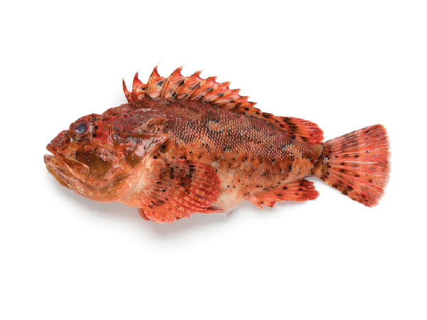

# Scorpaena scrofa (Шкарпина / Рыба-скабинка / škarpina)

Каменная рыба с острыми ядовитыми шипами, окраска маскирует её среди камней. Укус вызывает сильную боль и воспаление.

**Уровень опасности для человека:**
- Высокий: ядовитые шипы вызывают сильную боль, отёк и риск инфекции.

**Сезон и активность:**
- Июнь–октябрь.
- Днём прячется в камнях на мелководье (1–10 м).

**Рекомендации местных жителей:**
- **Распознавание:** неровная кожа, шипы на спине и жаберных крышках.
- **Защита:** носить обувь при прогулках по мелководью.
- **Что делать при контакте:**
  1. Оставшиеся шипы удалить щипцами.
  2. Опустить рану в горячую воду (40–45 °C) на 30–60 минут.
  3. Обратиться к врачу при сильной реакции.

