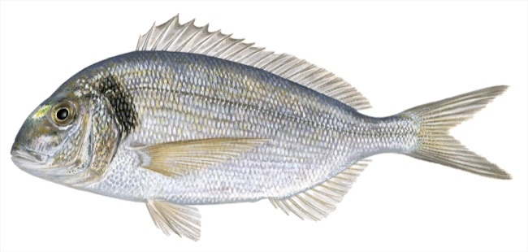

# Sparus aurata (Орада / orada)

**Популярность:** 1-е место по упоминаниям в местных соцсетях и форумах.

**Сезон и активность:**
- Основной сезон: июнь–сентябрь.
- Активность: утренние и вечерние часы, особенно при спокойном море.

**Техника ловли:**
- Основной метод: донная снасть с кормушкой.
- Используемые удилища: жесткие (тест до 100 г) для чувствительности.

**Троллинг:**
- Скорость: 3–4 узла.
- Место: прибрежные мелководья (5–15 м).
- Глубина приманки: 2–5 м.
- Вес и тип приманки: 20–40 г силиконовые рыбки или воблеры среднего размера.

**Наживки:**
- Креветка, моллюск, мелкая сардина.

**Оснастка:**
- Поводок 0,3–0,4 мм флюорокарбон, крючок №4–6.

**Рецепты от местных:**
1. **Орада на гриле:**
   - Ингредиенты: 1 свежая орада (~1 кг), оливковое масло, лимон, соль, перец, свежая петрушка.
   - Шаги:
     1. Очистить и выпотрошить рыбу, надрезать филе по бокам.
     2. Натереть солью, перцем и сбрызнуть оливковым маслом.
     3. Гриль разогреть до средней температуры.
     4. Жарить по 6–7 минут с каждой стороны до золотистой корочки.
     5. Перед подачей полить соком лимона и посыпать рубленой петрушкой.

2. **Орада в духовке:**
   - Ингредиенты: 1 орада, 2 помидора, 1 луковица, 3 зубчика чеснока, оливковое масло, розмарин, тимьян.
   - Шаги:
     1. Нарезать помидоры кружками, лук полукольцами, чеснок пластинками.
     2. В форму выложить рыбу, сверху овощи и травы.
     3. Полить маслом, приправить солью и перцем.
     4. Запекать при 180 °C 25–30 минут до готовности.

**Ссылка на фото:**
- https://upload.wikimedia.org/wikipedia/commons/3/33/Sparus_aurata_01.jpg