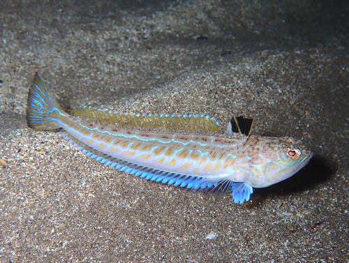

# Trachinus draco (Рыба‑стрелица / trahin)

Песчаная донная рыба с ядовитыми шипами на спине. Укус очень болезнен, может вызвать отёки, воспаления и общие симптомы интоксикации.

**Уровень опасности для человека:**
- Высокий: острые ядовитые шипы на спине вызывают сильную боль и отёк.

**Сезон и активность:**
- Май–октябрь.
- Прячется в песчаном грунте на глубине 5–20 м.

**Рекомендации местных жителей:**
- **Распознавание:** плоское тело, зарывается в песок, видны только глаза и спинные шипы.
- **Защита:** надевать защитные ботинки при ходьбе по мелководью.
- **Что делать при контакте:**
  1. Аккуратно извлечь шипы и промыть ранку морской водой.
  2. Опустить ногу в горячую воду (40–45 °C) на 30 минут.
  3. При сильной боли обратиться к врачу.

