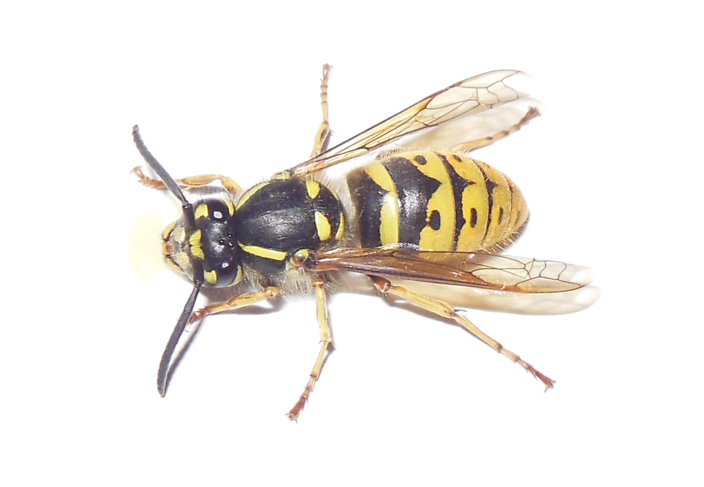

# Оса (Vespula vulgaris / Polistes spp.) / osa

Социальные жалящие насекомые с ярко-жёлтыми и чёрными полосами. Активны летом, привлекаются сладкой пищей.

**Уровень опасности для человека:**
- Низкая для большинства, но может быть опасной при аллергии на укусы.

**Сезон и активность:**
- Май–октябрь, особенно июнь–август.
- Активность днём, гнёзда в дуплах деревьев, стенах.

**Рекомендации местных жителей:**
- **Распознавание:** жёлто‑чёрная окраска, длина до 3 см.
- **Как избежать и как действовать:**
  - Избегайте сладкой пищи на открытом воздухе.
  - Не размахивайте руками при появлении осы.
  - При укусе использовать холод и антигистаминные средства.
