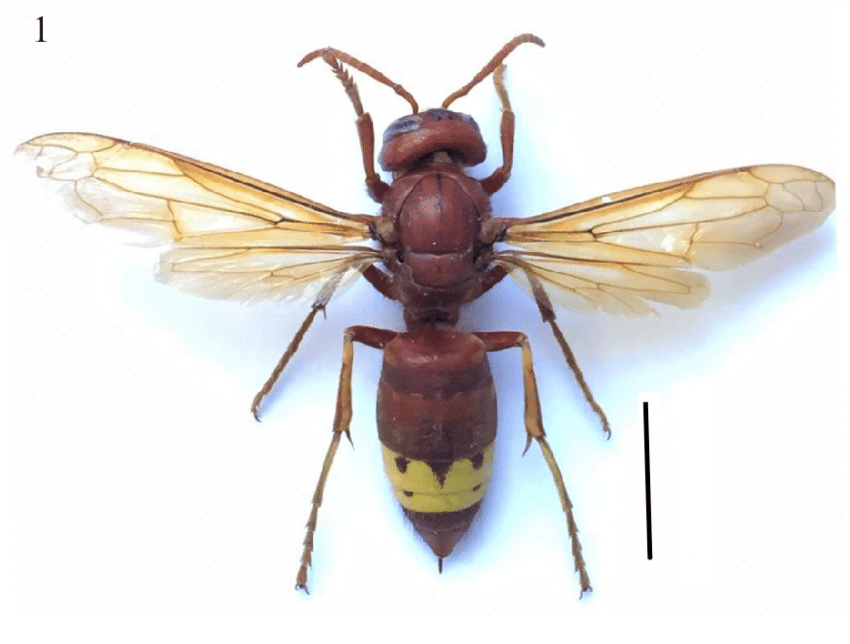

# Шершень восточный (Vespa orientalis) / šeršenj istočni

Вид шершней, распространённый в южной части Хорватии, имеет жёлто-коричневую окраску. Укус похож по симптомам на укус европейского шершня.

**Уровень опасности для человека:**
- Средний/высокий: болезненный укус, часто аллергические реакции.

**Сезон и активность:**
- Май–октябрь.
- Активность днём, гнёзда в почве или стенах.

**Рекомендации местных жителей:**
- **Распознавание:** оранжево‑чёрная окраска, размер до 2,5 см.
- **Защита:** избегать мест с гнёздами, при работах на земле использовать защитную одежду.
- **Что делать при укусе:**
  1. Удалить жало.
  2. Приложить холодный компресс.
  3. При ухудшении состояния обратиться к врачу.

