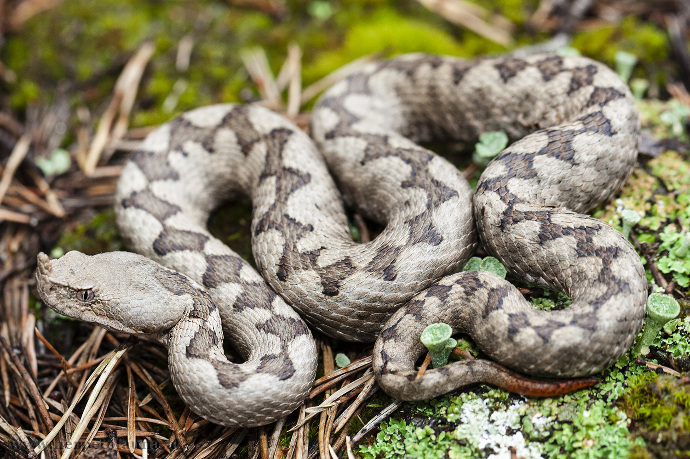

# Змия носатая гадюка (Vipera ammodytes) / zmija

Самая ядовитая змея региона, с зигзагообразным узором и "рожком" на морде. Встречается в каменистых местах, избегает открытых встреч.

**Уровень опасности для человека:**
- Высокий: сильный гемотоксин, укус может привести к серьёзным осложнениям.

**Сезон и активность:**
- Апрель–октябрь, дневная активность.
- Обитает в каменистых склонах и сухих лугах.

**Рекомендации местных жителей:**
- **Распознавание:** характерный «рожок» на носу, змеиная окраска с коричневыми полосами.
- **Защита:** носить высокие ботинки, не лазить по камням без осмотра.
- **Что делать при укусе:**
  1. Ограничить движение.
  2. Немедленно вызвать врача.
  3. Не применять турникет или разрезы.

